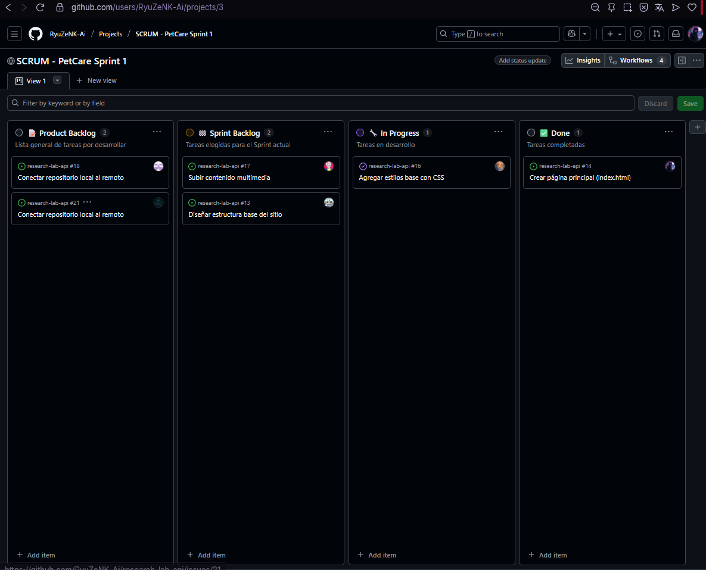
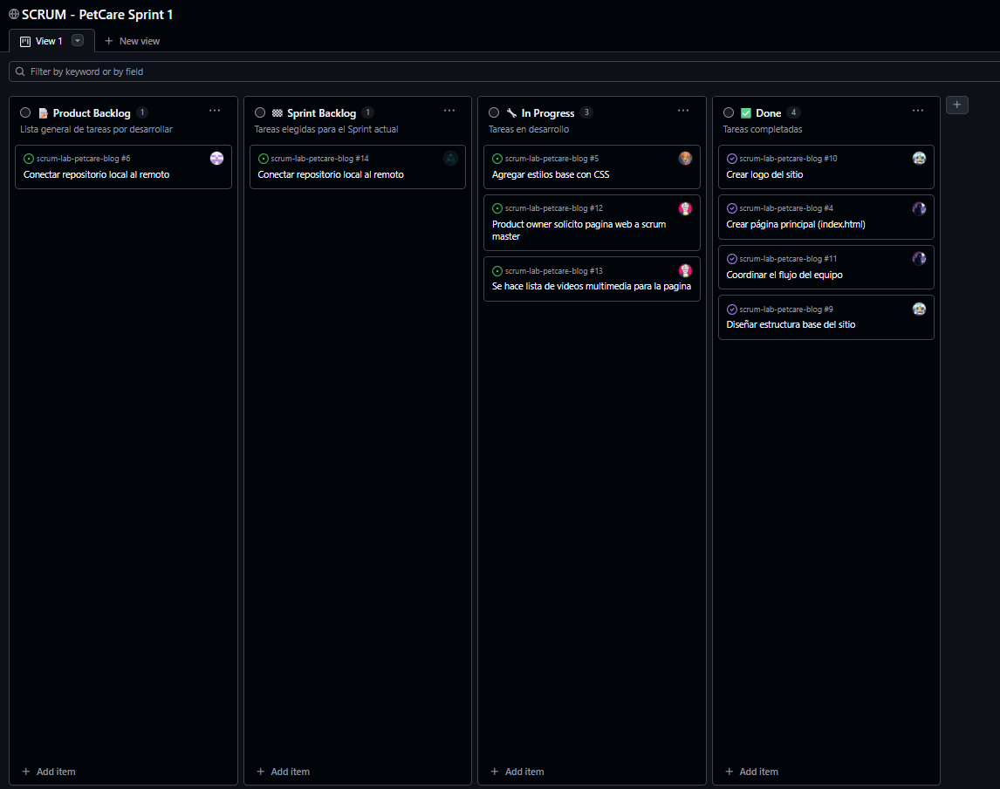

# 🧩 Tablero SCRUM y Flujo de Trabajo con Git 🧩

## 👥 Equipo **Q-ERO v3 Protocol** (roles)
1. 🧭 **Product Owner:** Karim Valenzuela  
2. 🧑‍🏫 **Scrum Master:** Nicolás Peña  
3. 👨‍💻 **Equipo de Desarrollo:**  
   - Agustín Valenzuela  
   - Washington Mardones  
   - Javier Valenzuela  
   - Mauricio Narváez  
   - Anita Morales  

## 🚀 Descripción general

El objetivo del proyecto fue **organizar el desarrollo en equipo** usando buenas prácticas de trabajo ágil, el **tablero SCRUM** fue la herramienta central del equipo para gestionar el progreso de las tareas, desde la planificación hasta la entrega final, esto permitió mantener un flujo ordenado, una comunicación continua.

## 📋 Estructura del flujo de trabajo

### 🧭 Planificación (Sprint Planning)
- El equipo definió las tareas principales a realizar durante el Sprint.  
- Cada tarea se agregó al tablero SCRUM con su descripción y su responsable correspondiente.  

### 🧱 Asignación de tareas
- Cada integrante tuvo asignada una tarea específica según su rol.  
- Las tareas se movieron entre las columnas del tablero:  
  **Product Backlog → Sprint Backlog → In Progress → Done**  

### 🌿 Trabajo individual
- Cada participante trabajo en la **tabla SCRUM** por separado 
- Se realizaron pequeños avances individuales que luego fueron integrados en el repositorio principal.  
- El equipo mantuvo el orden siguiendo convenciones de nombres y carpetas.  

### 🔄 Comunicación y actualización
- El tablero SCRUM se mantuvo actualizado durante todo el proceso.  
- Se simuló el flujo de trabajo ágil mediante la visualización del progreso en tiempo real.  
- Cada integrante informó su estado dentro del Sprint.  

### 🧱 Funciones del equipo SCRUM

| Rol | Función |
| --- | --- |
| 👩‍💼 **Product Owner** | Define las prioridades y valida lo entregado. |
| 🧑‍🏫 **Scrum Master** | Facilita la comunicación, gestiona los tiempos y ayuda a resolver bloqueos. |
| 👨‍💻 **Equipo de Desarrollo** | Ejecuta las tareas del Sprint y colabora en la entrega del producto. |

## 🧩 Estructura del repositorio
**/images** → capturas del tablero SCRUM  
**/articles** → artículos o notas del blog  
**/docs** → planificación o bocetos  
**README.md** → documentación general del proyecto  

## 🧰 Herramientas utilizadas
- **GitHub** → control de colaboración.  
- **GitHub Projects** → tablero SCRUM para gestión visual.  
- **Conventional Commits** → seguimiento de cambios y trazabilidad.  
- **Markdown** → documentación clara y legible.

## 🧠 Buenas prácticas aplicadas
- Se realizaron commits claros y organizados.  
- El tablero SCRUM se actualizó constantemente para reflejar el estado real de las tareas.  
- Se respetaron los roles definidos dentro del equipo.  

## 🐾 Logo del proyecto

## 📊 Tablero SCRUM (Sprint 1)

## 🚀 Sprint 1 – Ejecución

## 💬 Reflexión final

- **¿Cómo se sintieron al trabajar con roles definidos?**  
  Como equipo nos sentimos más organizados y enfocados. Tener roles específicos ayudó a distribuir mejor las responsabilidades y visualizar el progreso de cada integrante.  

- **¿Qué aprendieron sobre colaboración y comunicación?**  
  El trabajo en equipo nos permitió cumplir con las metas de forma más eficiente.  
  La comunicación constante ayudó a corregir errores a tiempo y a mantener una dinámica de apoyo mutuo.  

- **¿Qué cambiarían para su siguiente Sprint?**  
  Fijar un objetivo más claro y definir pautas desde el inicio para optimizar tiempos y mantener la coherencia del flujo de trabajo.  

